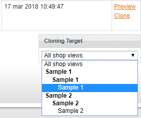

# Magento - clone static content

> magento-clone-static

This UserScript allows you to clone static contents (static blocks/static pages) between shops without any interference in shops source code.

## How it works?

On the bottom of the list with blocks and pages will be created new form with multiple-select of the views. After selecting views that interesed us, we must to click "Clone" button in each line with content that should be cloned. Cloning is queued so you can to click as much as want links - they will be done one by one.

## Limitations

* Script must to done cloning one by one because it's save data between pages in LocalStorage, so **don't clone parallel in the same domain**. Browser also must to allow using **LocalStorage**.
* Script works on new created tabs for saving/writing data. Before sending form with adding new content exists few seconds of delay, because Magento need to load his scripts. Because of that script will clone maximum single thing for each **minimum 4.5 seconds**.
* Script were created and tested only under **Magento 1.9**.
* Script will work **only** for urls that match these tests. You can of course modify it for yourself purposes.
 * `http*://*/*/cms_page/*`
 * `http*://*/*/cms_block/*`

## UserScript

UserScript it's a script which use browser extenstion as interface to inject custom JavaScript into websites with some kind of extra features distributed only for browser Extensions (e.g. opening/closing tabs).

[Click to learn more about UserScripts...](https://github.com/OpenUserJs/OpenUserJS.org/wiki/Userscript-beginners-HOWTO)

## Install

There are two ways to install. Manual, in case you have to copy and paste the script yourself. Or automatic (in case you have some UserScript extension installed that allows automatic installation) - then click the link below.

[**Install**](https://github.com/MrMaxie/gtranslate-cursive/raw/master/gtranslate-cursive.user.js)
